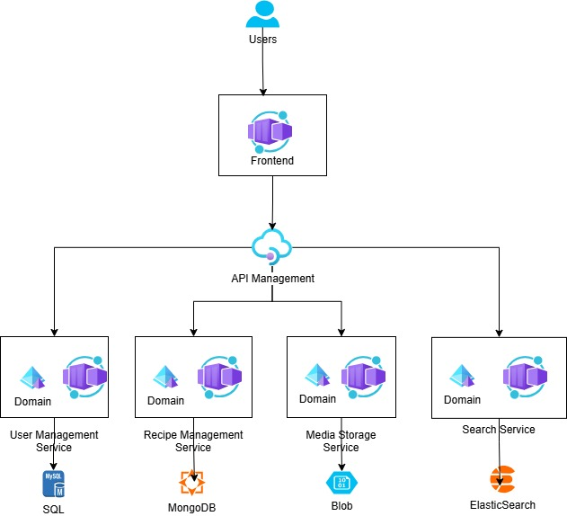
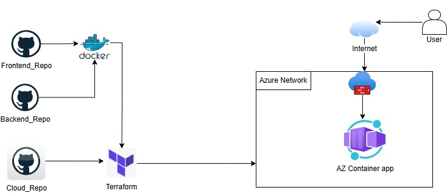

## Architecture



Components:
- Azure container apps: frontend, backend-db, backend
    + Pros: 
        ++ cost effective, charges incurred per request
        ++ Auto scaling
    + Cons: azure lock-in
- Azure API Management: connect frontend to backend, support authentication and security
    + Pros: 
        ++ Cost optimize, charges incurred per request.
        ++ Provides a single entry point for all APIs, making it easier to manage, secure, and monitor API traffic.
        ++ Scalability
    + Cons: higher tier could be expensive

## config.tf && providers.tf

1.Configure storageaccount in config.tf to your storageaccount

2. Configure subscription ID in providers.tf

## Azure login

```
az login
```

## Deploy in Powershell

```
Set-Item -Path env:TF_VAR_DOCKER_REGISTRY_USERNAME -Value 'user'
Set-Item -Path env:TF_VAR_DOCKER_REGISTRY_PASSWORD -Value 'pass'
Set-Item -Path env:TF_VAR_MYSQL_ROOT_PASSWORD -Value 'pw'

./deploy.ps1
```

## Deploy in Bash

```
export TF_VAR_DOCKER_REGISTRY_USERNAME="user"
export TF_VAR_DOCKER_REGISTRY_PASSWORD="pass"
export TF_VAR_MYSQL_ROOT_PASSWORD="pw"
```
