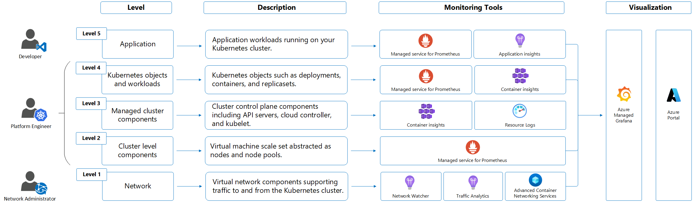

# Architecture



# Deploy Metric Server for HPA

```
kubectl apply -f https://github.com/kubernetes-sigs/metrics-server/releases/latest/download/components.yaml
```

# Deploy HPA

```
kubectl autoscale deployment frontend --cpu-percent=50 --min=1 --max=10 -n default
```